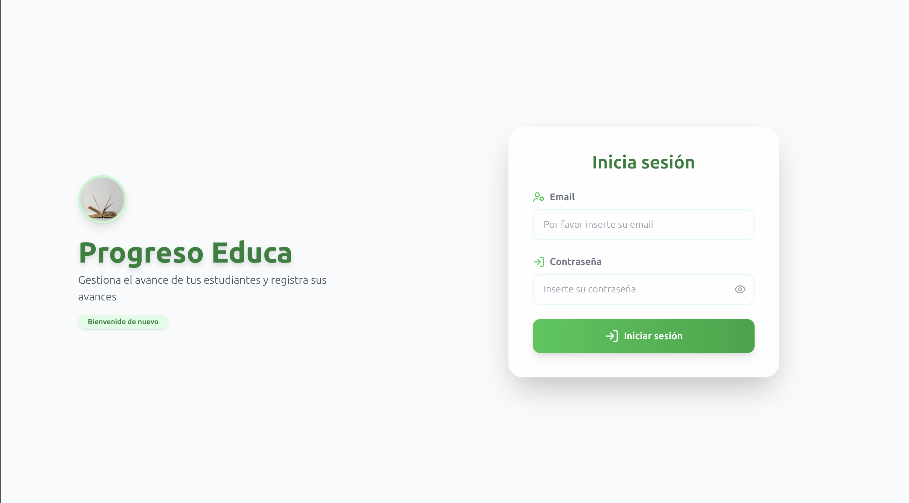

# Progreso Educa - Gestión de Usuarios

Sistema web para la gestión de usuarios y seguimiento de su progreso educativo.

## Descripción

Esta aplicación permite a administradores y tutores gestionar usuarios (estudiantes, tutores, administradores), registrar su avance, exportar datos y visualizar el historial de progreso de cada usuario. Incluye autenticación básica y filtros por rol y busqueda por email.




## Tecnologías utilizadas

- TypeScript
- Vite
- TailwindCSS
- Lucide Icons
- SweetAlert2
- Zod

## Instalación

1. Clona el repositorio:
   ```bash
   git clone https://github.com/EstebanMa12/gestion-usuarios-progreso.git
   cd gestion-usuarios-progreso
   ```
2. Instala las dependencias:
   ```bash
   npm install
   ```
3. Inicia el entorno de desarrollo:
   ```bash
   npm run dev
   ```

## Scripts disponibles

- `npm run dev`: Inicia el servidor de desarrollo.
- `npm run build`: Compila la aplicación para producción.

## Uso

- Accede a la aplicación en `http://localhost:5173` (o el puerto que indique Vite).
- Inicia sesión como:
  - **Administrador:** `admin@demo.com` / `Admin123`
  - **Tutor:** `tutor@demo.com` / `Tutor123`
- Registra, edita y filtra usuarios según rol y ruta.
- Visualiza y agrega progreso individual a cada usuario.
- Exporta la lista de usuarios a CSV.

## Estructura del proyecto

- `src/` - Código fuente principal
  - `components/` - Componentes reutilizables (formularios, tablas, modales, etc.)
  - `pages/` - Páginas principales (dashboard, registro, edición)
  - `schemas/` - Esquemas de validación con Zod
  - `utils/` - Utilidades (exportación CSV, almacenamiento local)
  - `layouts/` - Layout principal
- `index.html` - Entrada principal
- `tailwind.config.ts` - Configuración de TailwindCSS
- `tsconfig.json` - Configuración de TypeScript

## Licencia

MIT
